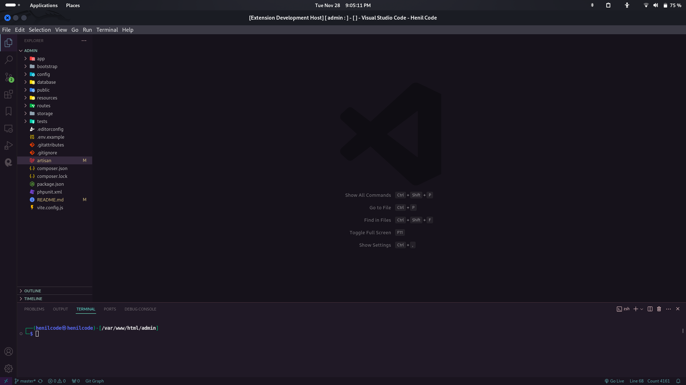
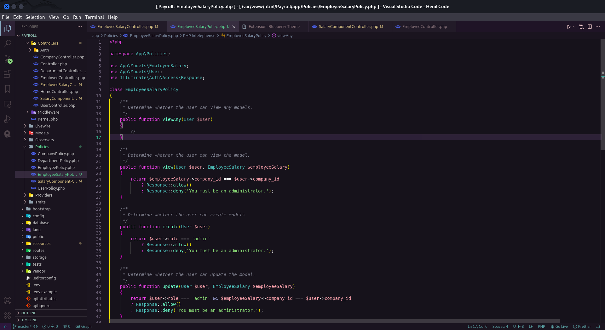

# Blueberry Theme for VS Code

  

Blueberry is a soothing and vibrant color theme for Visual Studio Code. Immerse yourself in the calming depths of a rich, deep blue, reminiscent of ripe blueberries. The carefully curated syntax highlighting ensures an optimal balance between readability and aesthetics.

## Installation

1. Open **Extensions** sidebar panel in Visual Studio Code. `View → Extensions`
2. Search for `Blueberry Theme`.
3. Click **Install** to install it.
4. Click **Reload** to reload your editor.
5. Navigate to `File > Preferences > Color Theme > Blueberry` or any other theme of your choice.

## Screenshots

Include screenshots here to showcase your theme in different coding scenarios.

## Feedback

Feedback is greatly appreciated. If you discover any issues or have suggestions for improvements, please [open an issue](https://github.com/henilcodes/blueberry/issues) on GitHub.

## Contributing

1. Fork the repository.
2. Clone your forked repository.
3. Make changes.
4. Create a pull request.

## License

This project is licensed under the [MIT License](LICENSE.md).

---

Enjoy coding with the Blueberry theme! 🍇 🍇 🍇
